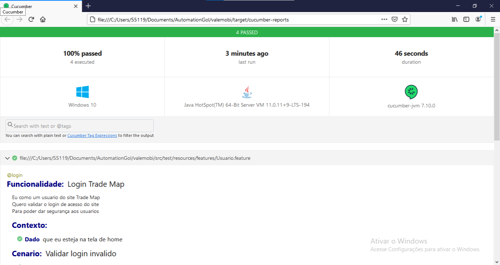

# Processo seletivo valemobi

Pagina inicial do relatório do cucumber.

### Pré requisitos

* Intellij IDE -> IDE utilizada para desenvolver o script de automação
* maven -> gerenciador de dependências
* java -> linguagem utilizada

### Executando os teste

* Pode ser encontrado no pacote runner um arquivo chamado SuiteTest basta executa-lo como Runner Test.

### Executando por linha de comando

* mvn test

### Autor

* Vinicius Ferreira de Oliveira
